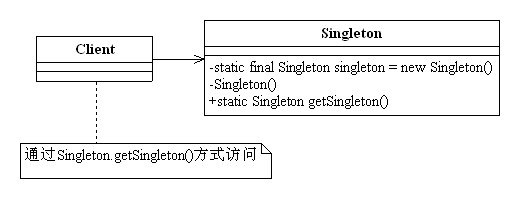

# 单例模式(Singleton Pattern) 
定义：Ensure a class has only one instance, and provide a global point of access to it. 
确保某一个类只有一个实例，而且自行实例化并向整个系统提供这个实例。   
Singleton类称为单例类，通过使用private的构造函数，确保了在一个应用中只产生一个实例，
并且是自行实例化的（在Singleton中自己使用new Singleton()）。  

单例模式的通用类图如下图：  

# 单例模式应用
### 1.单例模式的优点
 * 由于单例模式在内存中只有一个实例，减少了内存开支，特别是一个对象需要频繁的被创建、销毁，
   而且创建或销毁时性能又无法优化，单例模式的优势就非常明显；
 * 由于单例模式只生成一个实例，减少了系统性能开销，当一个对象的产生需要比较多的资源时，
   如读取配置、产生其他依赖对象时，则可以通过在应用启动时直接产生一个单例对象，
   然后永久驻留内存的方式来解决（在Java EE中采用单例模式时需要注意JVM垃圾回收机制）；
 * 单例模式可以避免对资源的多重占用，例如一个写文件动作，由于只有一个实例存在内存中，
   避免对同一个资源文件的同时写操作。
 * 单例模式可以在系统设置全局的访问点，优化环共享资源访问，例如可以设计一个单例类，负责所有数据表的映射处理。

### 2.单例模式的缺点 
 * 单例模式没有接口，扩展很困难，若要扩展，除了修改代码没有第二种途径可以实现。
   单例模式为什么不能增加接口呢？因为接口对单例模式是没有任何的意义，
   它要求“自行实例化”，并且提供单一实例、接口或抽象类是不可能被实例化的。
 * 单例模式对测试是不利的。在并行开发环境中，如果单例模式没有完成，是不能进行测试的，
   没有接口也不能使用mock的方式虚拟一个对象。
 * 单例模式与单一职责原则有冲突。一个类应该只实现一个的逻辑，而不关心它是否是单例的，
   决定它是不是要单例是环境决定的，单例模式把“要单例”和业务逻辑融合也在一个类中。

### 3.单例模式的使用场景
 * 要求生成唯一序列号的环境；
 * 在整个项目中需要有访问一个共享访问点或共享数据，
   例如一个Web页面上的计数器，可以不用每次刷新都记录到数据库中，使用单例模式保持计数器的值，并确保是线程安全的；
 * 创建一个对象需要消耗的资源过多，如要访问IO、访问数据库等资源；
 * 需要定义大量的静态常量和静态方法（如工具类）的环境，可以采用单例模式（当然，也可以直接声明为static的方式）；

# 单例模式的扩展
需要产生固定数量对象的模式就叫做有上限的多例模式，它是单例模式的一种扩展，采用有上限的多例模式，
我们可以在设计时决定在内存中有多少个实例，方便系统进行扩展，修正单例可能存在的性能问题，提供系统的响应速度。
例如读取文件，我们可以在系统启动时完成初始化工作，在内存中启动固定数量的reader实例，
然后在需要读取文件时就可以快速响应。  

# 最佳实践
单例模式是23个模式中比较简单的模式，应用也非常广泛，如在Spring中，每个Bean默认就是单例的，
这样做的优点是Spring容器可以管理这些Bean的生命期，决定什么时候创建出来，什么时候销毁，销毁的时候要如何处理，等等。
如果采用非单例模式（Prototype类型），则Bean初始化后的管理则交由J2EE容器，Spring容器不再跟踪管理Bean的生命周期。  
使用单例模式需要注意的一点就是JVM的垃圾回收机制，如果我们的一个单例对象在内存中长久不使用，
JVM就认为这个对象是一个垃圾，在CPU资源空闲的情况下该对象会被清理掉，下次再调用时就需要重新产生一个对象。
如果我们在应用中使用单例类作为有状态值（如计数器）的管理，则会出现回复原状的情况，应用就会出现故障。
如果确实需要采用单例模式来记录有状态的值，有两种办法可以解决该问题：

- 由容器管理单例的生命周期  
- 状态随时记录:可以使用异步记录的方式，或者使用观察者模式，记录状态的变化，写入文件或写入数据库中，
  确保即使单例对象重新初始化也可以从资源环境获得销毁前的数据，避免应用数据丢失。 